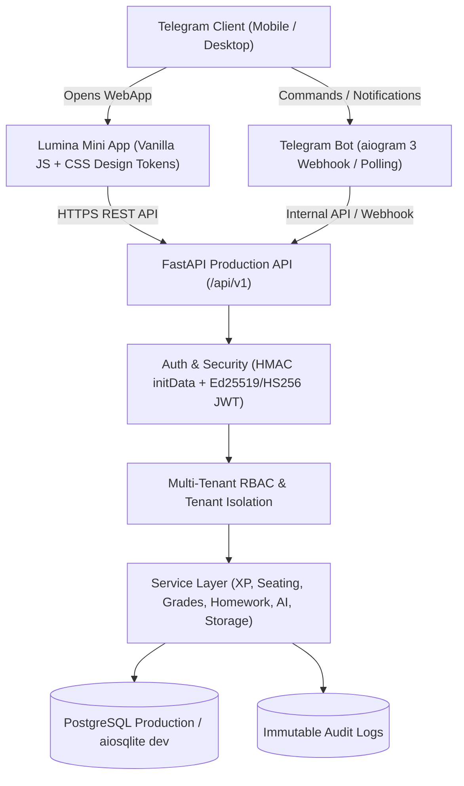

# LUMINA — SYSTEM ARCHITECTURE & TECHNICAL SPECIFICATION

## 1. System Overview
Lumina is an enterprise-grade Telegram School Operating System designed for multi-tenant K-12 and secondary academic institutions. It couples an asynchronous Python backend with a high-performance Telegram Bot (aiogram 3) and a touch-optimized Telegram Mini App.

## 2. Technology Stack
- **Backend**: Python 3.12+, FastAPI, Pydantic v2, SQLAlchemy 2.0 (AsyncIO), Alembic.
- **Bot**: aiogram v3 (Dispatcher, FSM, Webhook router).
- **Database**: PostgreSQL with connection pooling (`pool_size=20`, `max_overflow=10`), strict foreign keys, cascade deletes, and timezone-aware timestamps (`TIMESTAMP WITH TIME ZONE`).
- **Frontend Mini App**: Modern Vanilla JS (ES Modules) + Vanilla CSS System Tokens. ZERO bloated client frameworks. Instant 60 FPS rendering on iOS & Android WebViews.
- **Internationalization**: Dual-language engine (`ru` Russian, `uz` Uzbek Latin) driving all backend schemas, API validation errors, and frontend components.

## 3. Core Domains & Services
1. **Academic & Multi-Tenancy**: Schools, Classes, Subjects, Lessons, Curriculum mapping with strict `school_id` isolation.
2. **Grading Engine**: Multi-scale grading (5-point, 12-point, 100-point, Letter grades), weighted averages, immutable audit logs (`audit_logs`), and a 5-minute teacher undo window.
3. **Seating & Classroom Orchestration**: Desk coordinate grid mapping (`DeskSeating`), drag-and-drop seating, and fair random student selection with pool rotation.
4. **Gamification & Daily Vibe**: `XPTransaction` ledgers, deterministic level calculation, daily activity streaks with timezone support, achievement badges, and student vibe check-ins.
5. **AI Educational Assistant**: Adaptive hints without direct answer spoilers, structured pre-test recaps, and parent weekly summary reports with resilient offline fallbacks.
6. **Digital Backpack**: Role-scoped educational file storage metadata with tenant-isolated access controls.
